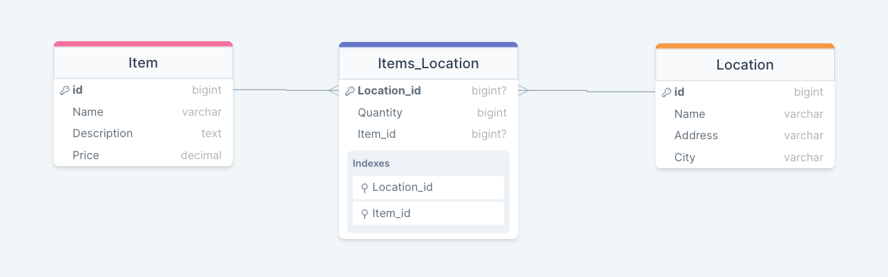

> This project is The Ruby on Rails inventory tracking web application for a logistics company
> this project is a take-home assignement from [Fall 2022 - Shopify Developer Intern Challenge Question](https://docs.google.com/document/d/1DuHN-nPWvZJdMxrOVvHbu3OomMvRrCfCnrFXqgqG56Q/edit#)

This Ruby on Rails application allows the user to do Basic CRUD Functionality:
- Create inventory items
- Edit Them
- Delete Them
- View a list of them

## [Live Demo](https://inventory-tracking-dz.onrender.com/)

## Getting Started
- clone the repository
  `git clone https://github.com/selma-belhadj/InventoryTracking.git`
- navigate to the folder
  `cd InventoryTracking`
- checkout the feature
  `git checkout developement`
- Install packages
  `bundle install`
- Setup database
  `rails db:setup`
- Run migration
  `rails db:migrate`

## Built With

- Ruby
- Ruby on Rails
- PostgreSQL

## Authors

👤 **Selma Belhadj**

- GitHub: [@selma-belhadj](https://github.com/selma-belhadj)
- Twitter: [@selma_bel_hadj](https://twitter.com/selma_bel_hadj)
- LinkedIn: [@selma-belhadj](https://www.linkedin.com/in/selma-belhadj/)

## 🤝 Contributing

Contributions, issues, and feature requests are welcome!

Feel free to check the [issues page](https://github.com/selma-belhadj/InventoryTracking/issues).

## Show your support

Give a ⭐️ if you like this project!

## 📝 License

This project is [MIT](./MIT.md) licensed.
